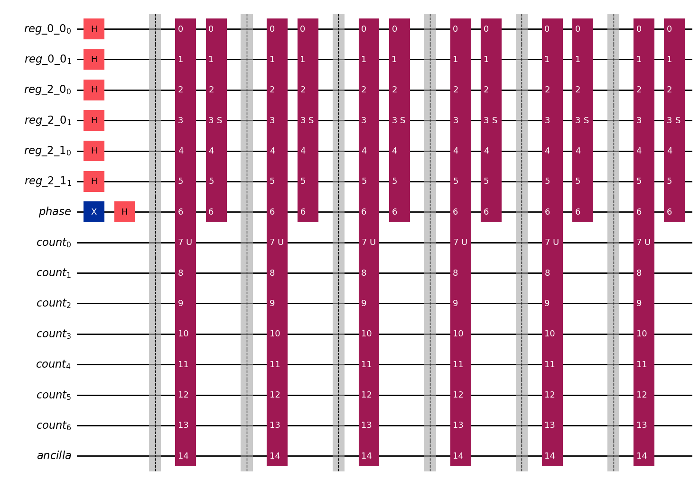
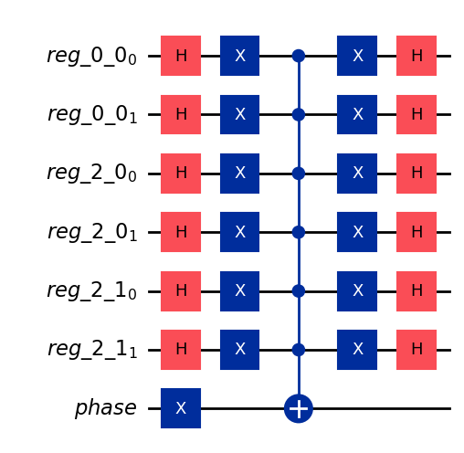
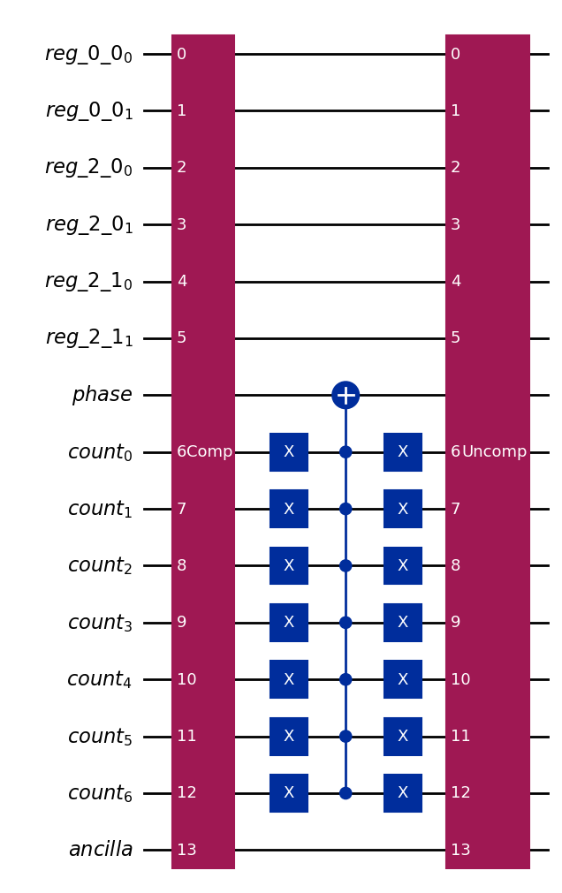

# SudokuSolver
This program solves 4\*4 Sudokus using Grover search (quantum computing) algorithm with the help of qiskit library.

# Problem setup
Start with a 4\*4 board of Sudoku with some number of clues such that there is exactly one solution. The input is given by a 4\*4 matrix where each clue is a number between 1 and 4, and unknown entries are filled with 0. 
It is known that at least 4 clues are needed in any valid 4\*4 Sudoku, so there are at most $4^{12}$ ways to fill the board.  

# List of functions:
*   SudokuSolver: main function that solves an 4\*4 Sudoku
*   Grover_search: performs the Grover search algorithm. This is used in SudokuSolver.
*   DistinctFour: key helper function which takes a group of four entries in the Sudoku (i.e. row/column/box) and checks whether all the entries are distinct.
*   increment_counter: helper function used to increment the counter registers (in order to keep track of the occurences where the same number appears more than once in the same group of four).

# Overview of the program
Let $0\leq N\leq 12$ be the number of unknown entries. We build a quantum circuit which performs Grover search algorithm over the space of possible solutions (which has size $4^N$). A 4\*4 Sudoku board has 12 groups of four that need to be validated (i.e. rows/columns/2\*2 boxes). In each group of four, all four numbers must be pairwise distinct from each other, so this requires 6 checks. In total, validating a particular solution of Suzoku requires at most $12*6=72$ checks. Motivated by this, we use the following set of registers.

*   memory_registers ($N$ copies of 2-qubit registers. They take up $\leq24$ qubits in total.) This represents the search space.
*   phase_register (1 qubit): This is used to implement the phase flip in the oracle/marker appearing in Grover algorithm.
*   count_register (7 qubits): This records the number ($\leq72$) of pairs of entries that are equal within the groups of four. 7 qubits are needed to prevent an overflow. 
*   ancilla_compare (1 qubit): This is used as a temporary flag when deciding whether a pair of numbers is equal or not.

As an example, consider the matrix below ($N=3$): 

$$
\begin{bmatrix}
0 & 1 & 0 & 3 \\
3 & 4 & 0 & 2 \\
4 & 3 & 2 & 1 \\
1 & 2 & 3 & 4
\end{bmatrix}
$$

In this case, the quantum circuit looks like:

Note that registers marked as "reg" are the memory_registers.

In the leftmost phase of the circuit, we apply Hadamard gates to create superposition in memory_registers. Additionally, we prepare the phase_register in the |-> state. (We follow the phase flip implementation via the X-gate found in the book of Michael A. Nielsen & Isaac L. Chuang.)

The rest is the repetition of marker ('U') and diffuser ('S'), and the number of repititions is given by an integer approximation of 
$\frac{\pi \cdot\sqrt{2^{2N}}}{4}={\pi\cdot 2^{N-2}}$.

Diffuser follows the standard construction as shown below. Note that we implemented the phase shift by the combination of an X-gate and an MCX-gate as we already prepared the phase_register in the |-> state. In the above example, it looks like:

As for the marker, we flip the phase precisely when the state in the memory_registers represents a valid solution of Sudoku. To verify that a state represents a correct solution, we iterate over the $\leq 72$ pairs of entries to compare. The number of pairs consisting of equal numbers is stored in count_register. This is handled in the helper function 'DistinctFour' with the help of 'increment_counter' function. (This is where the ancilla qubit is used.) When count_register is bigger than 0, the program determines that this is not a valid solution and does not flip the phase. See the diagram below:

In this diagram, the gate 'Comp' carries out the pairwise verification and counting. 'Uncomp' carries out necesary uncomputations. 

# Other components in the file 'Sudoku_Solver_Grover.ipynb'
In this python document, in addition to the above functions, we have also provided codes which simulate and test the Sudoku solver (by taking emasurements 5 times). In the file, you can find the test cases of the above matrix as well as the following matrix (which has $N=5$). 

$$
\begin{bmatrix}
0 & 1 & 0 & 3 \\
3 & 4 & 0 & 2 \\
4 & 3 & 2 & 0 \\
1 & 0 & 3 & 4
\end{bmatrix}
$$

# Note on practical performance
When simulated on classical computers with standard computing powers, this program is too slow to solve 4\*4 Sudokus with few clues. In my simulation, $N=5$ case already required about 1 minute of computations. 
